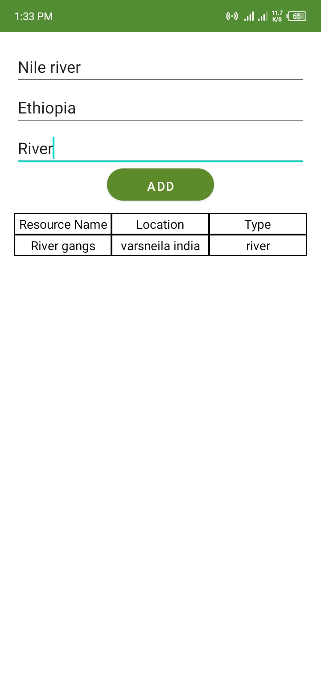
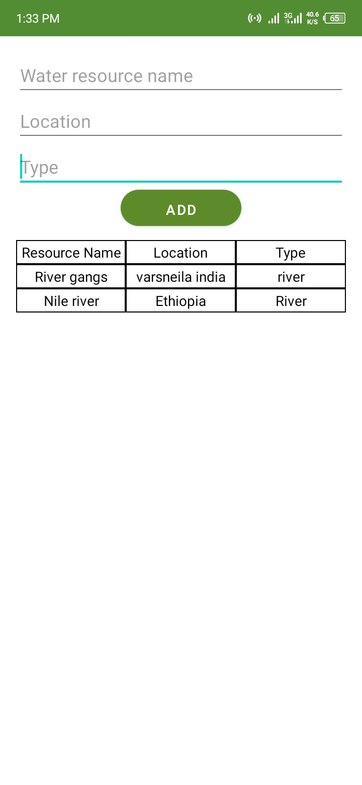

 
  
  &#xa0;

<h1 align="center">Dynamic Layout</h1>

<h1> Screenshoots </h1>

 

  
  
   

<!-- 

 -->

programming language

- [Kotlin](https://kotlin.com/)

&#xa0;

<a href="#top">Back to top</a>
